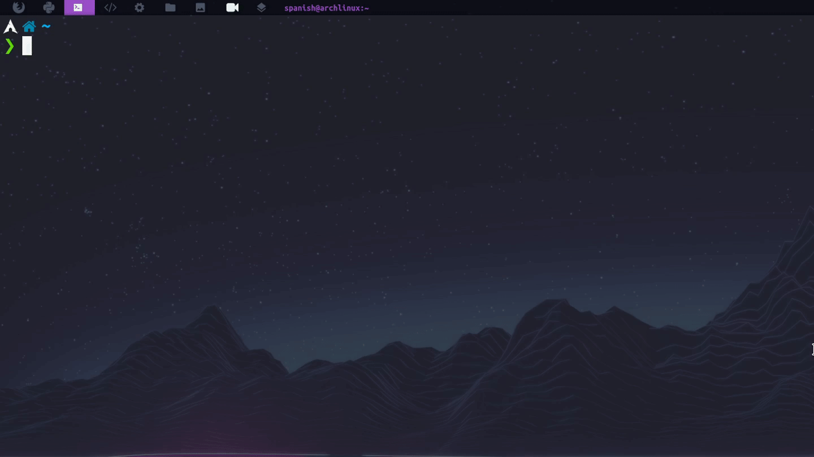
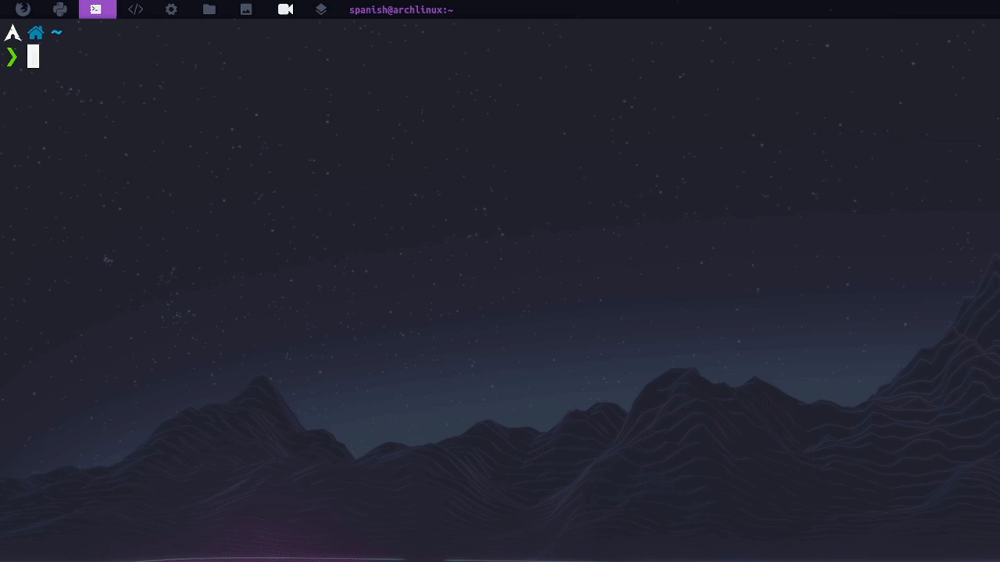

# Decritty

> Inspired on [pycritty](https://github.com/antoniosarosi/pycritty)



> Change your alacritty config in real time!<br>

---

**Table of Contents**

- [:wrench: Installation](#:wrench:-installation)
- [:dark_sunglasses: Usage](#:dark_sunglasses:-usage)
- [:file_folder: Folder Structure](#:file_folder:-folder-structure)
- [:pencil: Fonts](#:pencil:-fonts)

---

## :wrench: Installation

- npm

  ```shell
  npm i -g decritty
  ```

## :dark_sunglasses: Usage

- Initial configs

  > Run the command below to create the initial settings<br>
  > If the alacritty folder is already exists, it will be back-up and the folder structure will be set up to work correctly

  ```shell
  decritty -i
  ```

- Opacity

  > This argument receive a int | float

  ```shell
  decritty -o 0.6
  ```

- Padding

  > This argument receives 2 parameters x, y of type int<br>
  > X and Y need not be exactly the same

  ```shell
  decritty -p 2 2
  ```

  ```shell
  decritty -p 4 8
  ```

- Font

  > This argument receives the alias that is in the font file<br>
  > You may be found the file on `~/.config/alacritty/settings/fonts.yml`<br> >[click here](#:pencil:-fonts) to see structure of `fonts` file

  ```shell
  decritty -f FiraCode
  ```

- Font Size

  > This argument receive a int

  ```shell
  decritty -s 18
  ```

- Themes

  > This argument receive the name of theme<br>
  > You may be found the file folder on ~/.config/alacritty/settings/themes<br> >[click here](#:file_folder:-folder-structure) to see folder structure

  ```shell
  decritty -t AyuDark
  ```

  

- If you wish, you can match all the arguments
  

## :file_folder: Folder Structure

```
alacritty
│   alacritty.yml
│
│
└───settings
│   │   fonts.yml
│   │
│   │
│   └───themes
│       │   AyuDark.yml
│       │   AyuMirage.yml
│       │   ...
```

## :pencil: Fonts

> `fonts.yml`

```yaml
fonts:
  Ubuntu: UbuntuMono Nerd Font # alias: font name
  FiraCode: Fira Code Nerd Font
```

---

Made by [the spanish guy](https://github.com/the-spanish-guy) with :purple_heart:
